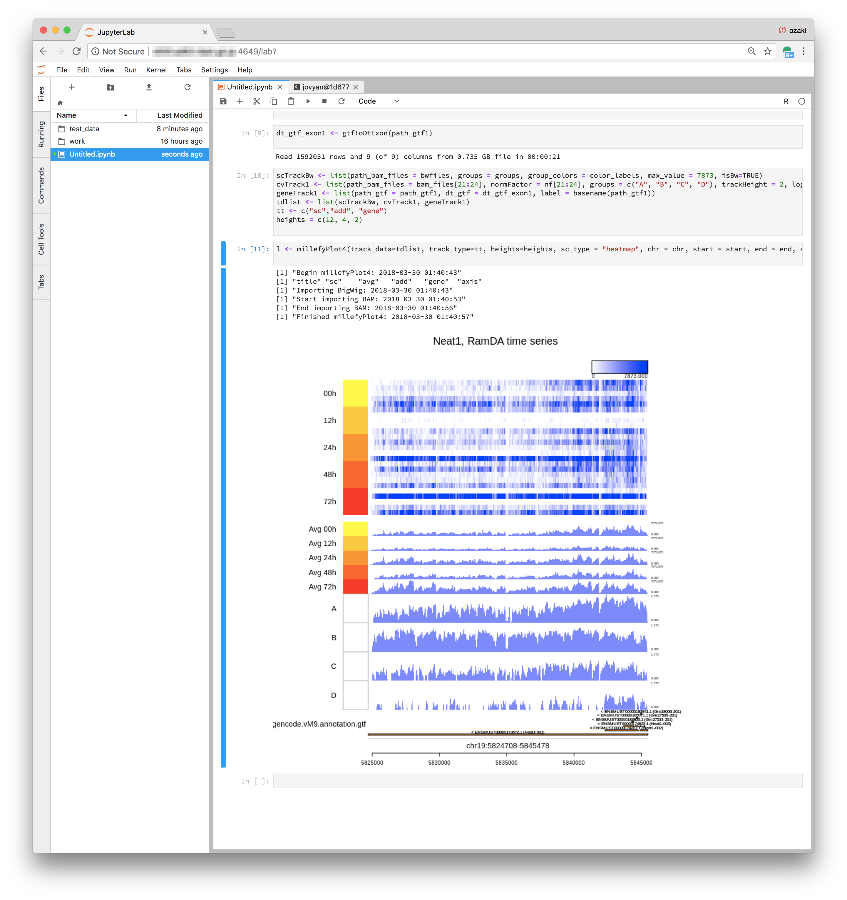

# `datascience-notebook-millefy`
## What's this?
A Docker image for running [Millefy](https://github.com/yuifu/millefy) on [JupyterLab](https://github.com/jupyterlab/jupyterlab).

DockerHub: https://hub.docker.com/r/yuifu/datascience-notebook-millefy/


### How is it built?

Millefy (version 0.1.3 was) was installed in the Docker image of [Jupyter Notebook Data Science Stack](https://github.com/jupyter/docker-stacks/tree/master/datascience-notebook) (`jupyter/datascience-notebook:c88678a1c7c9`; latest on 2018/03/30).


## How to install

### Build

```
cd Dockerfile
docker build -t yuifu/datascience-notebook-millefy:c88678a1c7c9-v0.1.3 .
```

### Pull

```
docker pull yuifu/datascience-notebook-millefy:c88678a1c7c9-v0.1.3 .
```

## How to use

### Run by `docker run`

```
docker run -d --rm -p 4649:8888 \
-v `pwd`:/home/jovyan/work \
-e JUPYTER_ENABLE_LAB=1 \
--user root -e NB_UID=10011 -e GRANT_SUDO=yes \
yuifu/datascience-notebook-millefy:c88678a1c7c9-v0.1.3 \
start-notebook.sh --NotebookApp.token=''
```

### Run by `docker-compose`

Write `docker-compose.yml` as follows:

```
version: '2'
services:
  jupyter:
    image: yuifu/datascience-notebook-millefy:c88678a1c7c9-v0.1.3
    environment:
      JUPYTER_ENABLE_LAB: 1
      NB_UID: 10011
      GRANT_SUDO: "yes"
    user: root
    ports:
      - 4649:8888
    volumes:
      - ./:/home/jovyan/work
      - ../test_data:/home/jovyan/test_data
    command: start-notebook.sh --NotebookApp.token=''
```

Then

```
docker-compose up -d
```


### Use

After running a container, access `localhost:4649` by your web browser.



For more information on Millefy itself, please refer to [Millefy](https://github.com/yuifu/millefy)


## License

Copyright (c) 2018 Haruka Ozaki Released under the MIT license
